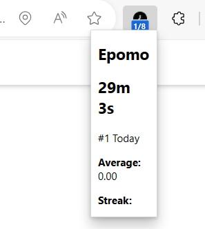
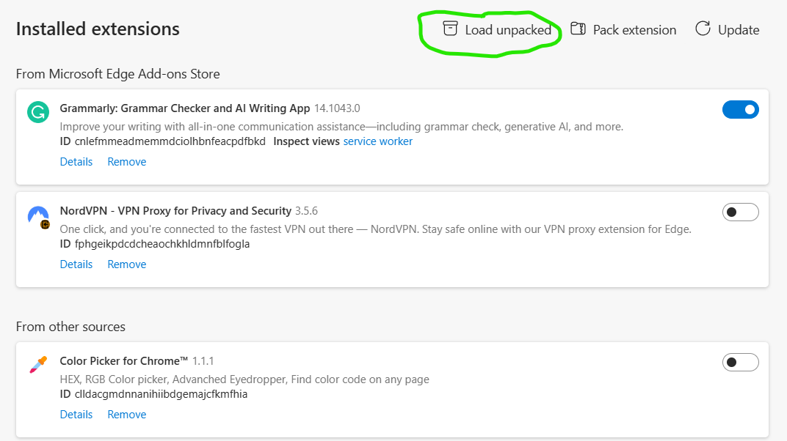

Epomo
=====

Epomo is a Chrome extension that acts as a pomodoro timer with the following features:
* pomodoro timer with duration of 30 minutes
* Built-in keyboard short cut (Alt + P) to start the timer
* Sound alarms and notification
* Record number of pomodoro sessions per day

    

### How to use
This is step-by-step instruction for Microsoft Edge but other browsers should be similar. \\
* Step 1: Download the project into a folder 
* Step 2: Follow the [link](edge://extensions/) and load the folder with "Load unpacked" button

    

* Step 3: Try press Alt + P to start the timer

### Feedback and contributions are welcome!
I am new to open-source community and software development. So if there is any advice on clean code practice, documentations, or suggestions for new features for the extension, feel free to inbox me at:
* Email: 21uyen.nt@vinuni.edu.vn
* [Facebook](https://www.facebook.com/uyen.nguyenthai.98/)

